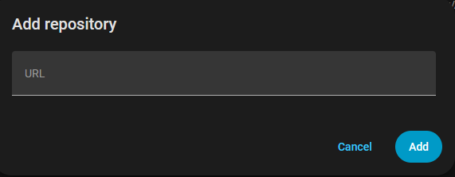
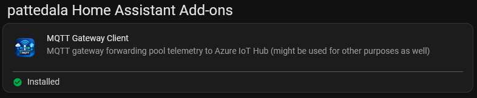

# Hass-Addons - MQTT Gateway Client

### Automated installation

## About
A complete and easy way to send a MqTT message to any remote location, as Azure event hub etc.

This is for you if you want to quickly set up a MqTT message transfer without much fuss. It doesn't require much familiarity with Home Assistant, its architecture, or MqTT. Detailed install instructions are provided below but you can just add this repo, click "ADD APP REPOSITORY" above and open the Web UI. It will tell you what to do and only takes a few simple clicks.  Detailed install instructions are following if that doesn't seem clear.

## Detailed Install Instructions
1. Navigate in your Home Assistant frontend to <kbd>Settings</kbd> -> <kbd>Add-ons</kbd> -> <kbd>Add-on Store (Bottom Right)</kbd>.

2. Click the 3-dots menu at upper right <kbd>...</kbd> > <kbd>Repositories</kbd> and add this repository's URL: [https://github.com/pattedala/Hass-Addons](hhttps://github.com/pattedala/Hass-Addons)

   

3. Reload the page , scroll to the bottom to find the new repository, and click the new add-on named "Pattedala Home Assistant Add-ons":

   
   
   Note: Home Assistant loads the repository in the background and the new item won't always show up automatically.  You might need to wait a few seconds and then "hard refesh" the page for it to show up.  On most browser the keyboard shortcut for this is CTRL+F5. If it still doesn't show up, clear your browser's cache and it should then.
4. Click <kbd>Install</kbd> and give it a few minutes to finish downloading.

## Configuration
After you start the addon you have an opportunity to review your settings within the addon's Web-UI before you connect it to your destination.  It is recommended to modify the setting this way because the UI makes it easy and explains what each option does.

>This project requires a little financial support to keep the Google Drive integration up and running, but it's completely free for you to use.
>If you'd like to help keep the servers humming, the coffee flowing, and the developer marginally motivated, you can join the generous people keeping the lights on at::
>  
>

